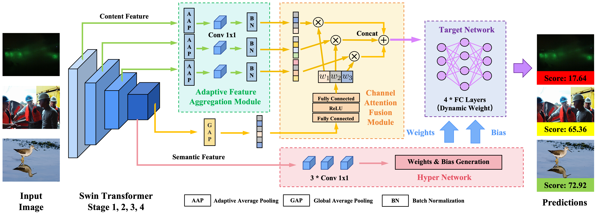

# SMART-IQA: Swin Multi-scale Attention-guided Regression Transformer for Blind Image Quality Assessment

[](https://www.python.org/downloads/)
[](https://pytorch.org/)
[](https://opensource.org/licenses/MIT)

Official PyTorch implementation of **SMART-IQA**, a state-of-the-art blind image quality assessment method that achieves **0.9378 SRCC** on KonIQ-10k.

> **Paper**: SMART-IQA: Swin Multi-scale Attention-guided Regression Transformer for Blind Image Quality Assessment  
> **Author**: Nuoyan Chen  
> **Institution**: Shanghai Jiao Tong University

---

## 🌟 Highlights

- **🏆 State-of-the-Art Performance**: 0.9378 SRCC on KonIQ-10k (+3.18% over HyperIQA)
- **🔬 Key Finding**: 87% of performance gain comes from Swin Transformer backbone, revealing feature extraction as the primary bottleneck in content-adaptive BIQA
- **🧠 Interpretable Behavior**: First experimental evidence of adaptive "triage" strategy—99.67% attention on deep semantic stages for high-quality images vs. balanced attention for low-quality images
- **⚡ Efficient Variants**: Three model sizes (Tiny: 28M, Small: 50M, Base: 88M parameters) with flexible performance-efficiency trade-offs

---

## 📋 Table of Contents

- [Architecture Overview](#architecture-overview)
- [Installation](#installation)
- [Dataset Preparation](#dataset-preparation)
- [Training](#training)
- [Testing](#testing)
- [Pretrained Models](#pretrained-models)
- [Reproducing Paper Results](#reproducing-paper-results)
- [Citation](#citation)

---

## 🏗️ Architecture Overview

SMART-IQA extends HyperIQA's content-adaptive paradigm with three key innovations:

1. **Swin Transformer Backbone**: Hierarchical vision transformer with shifted window attention for global context modeling and multi-scale feature extraction
2. **Adaptive Feature Aggregation (AFA)**: Preserves spatial structure (7×7 grid) while unifying multi-scale features, enabling localization of non-uniform distortions
3. **Channel Attention Mechanism**: Dynamically weights feature hierarchies based on image content—low-level textures for distorted images, high-level semantics for pristine ones



---

## 🔧 Installation

### Requirements

- Python 3.8+
- PyTorch 1.8+
- CUDA 11.0+ (for GPU training)

### Setup

```bash
# Clone the repository
git clone https://github.com/cny123222/Perceptual-IQA-CS3324.git
cd Perceptual-IQA-CS3324

# Install dependencies
pip install -r requirements.txt
```

**Key Dependencies**:
```
torch>=1.8.0
torchvision>=0.9.0
timm>=0.4.12  # For Swin Transformer pretrained models
scipy
numpy
Pillow
```

---

## 📊 Dataset Preparation

### KonIQ-10k (Primary Training Dataset)

1. Download KonIQ-10k from [official website](http://database.mmsp-kn.de/koniq-10k-database.html)
2. Organize the dataset as follows:

```
koniq-10k/
├── 1024x768/              # Images
│   ├── 000001.jpg
│   ├── 000002.jpg
│   └── ...
├── koniq10k_scores_and_distributions.csv  # MOS scores
├── koniq_train.json       # Official train split
└── koniq_test.json        # Official test split
```

### Cross-Dataset Evaluation (Optional)

For cross-dataset generalization experiments:

- **SPAQ**: Smartphone photography → `spaq-test/`
- **KADID-10K**: Synthetic distortions → `kadid-test/`
- **AGIQA-3K**: AI-generated images → `agiqa-test/`

---

## 🚀 Training

### Basic Training (Swin-Base)

```bash
python scripts/train_smart_iqa.py \
    --model_size base \
    --use_attention \
    --koniq_path ./koniq-10k \
    --epochs 50 \
    --lr 5e-7 \
    --batch_size 8
```

### Training with Image Preloading (Faster)

```bash
python scripts/train_smart_iqa.py \
    --model_size base \
    --use_attention \
    --preload \
    --koniq_path ./koniq-10k \
    --epochs 50 \
    --lr 5e-7 \
    --batch_size 8
```

### Model Size Variants

```bash
# Swin-Tiny (28M parameters)
python scripts/train_smart_iqa.py --model_size tiny --use_attention

# Swin-Small (50M parameters) - Recommended for deployment
python scripts/train_smart_iqa.py --model_size small --use_attention

# Swin-Base (88M parameters) - Best performance
python scripts/train_smart_iqa.py --model_size base --use_attention
```

### Key Arguments

| Argument | Description | Default |
|----------|-------------|---------|
| `--model_size` | Model variant: `tiny`, `small`, or `base` | `base` |
| `--use_attention` | Enable channel attention mechanism | `False` |
| `--preload` | Preload images to memory for faster training | `False` |
| `--koniq_path` | Path to KonIQ-10k dataset | `./koniq-10k` |
| `--epochs` | Number of training epochs | `50` |
| `--lr` | Learning rate (5e-7 recommended for Swin) | `5e-7` |
| `--batch_size` | Batch size | `8` |
| `--test_spaq` | Enable SPAQ cross-dataset testing | `False` |

---

## 🧪 Testing

### Test on KonIQ-10k

```bash
python scripts/train_hyperiqa.py \
    --dataset koniq-10k \
    --koniq_path ./koniq-10k \
    --test_only \
    --resume checkpoints/best_model.pth
```

### Cross-Dataset Evaluation

```bash
python scripts/test_cross_dataset.py \
    --checkpoint checkpoints/best_model.pth \
    --model_size base \
    --use_attention
```

This will evaluate on SPAQ, KADID-10K, and AGIQA-3K datasets.

---

## 📦 Pretrained Models

We provide pretrained models for all three variants:

| Model | Parameters | SRCC | PLCC | Download |
|-------|------------|------|------|----------|
| SMART-Tiny | 28M | 0.9249 | 0.9360 | [Link](checkpoints/) |
| SMART-Small | 50M | 0.9338 | 0.9455 | [Link](checkpoints/) |
| SMART-Base | 88M | **0.9378** | **0.9485** | [Link](checkpoints/) |

**Usage**:
```python
from smart_iqa import SmartIQA
import torch

# Load model
model = SmartIQA(model_size='base', use_attention=True)
checkpoint = torch.load('checkpoints/best_model.pth')
model.load_state_dict(checkpoint['model_state_dict'])
model.eval()

# Predict quality
with torch.no_grad():
    quality_score = model(image_tensor)  # Range: 0-100
```

---

## 📈 Reproducing Paper Results

### Main Results (Table I)

```bash
# Train SMART-Base on KonIQ-10k
python scripts/train_smart_iqa.py --model_size base --use_attention --epochs 50 --lr 5e-7
```

**Expected Results**: SRCC ≈ 0.9378, PLCC ≈ 0.9485

### Ablation Study (Table II, Figure 3)

```bash
# 1. Baseline: HyperIQA with ResNet-50
python scripts/train_hyperiqa.py --dataset koniq-10k

# 2. Swin-Base backbone only (no AFA, no attention)
python scripts/train_smart_iqa.py --model_size base

# 3. Swin-Base + AFA (no attention)
python scripts/train_smart_iqa.py --model_size base

# 4. Full model (Swin-Base + AFA + Attention)
python scripts/train_smart_iqa.py --model_size base --use_attention
```

### Cross-Dataset Generalization (Table III)

```bash
python scripts/test_cross_dataset.py \
    --checkpoint checkpoints/best_model.pth \
    --model_size base \
    --use_attention
```

### Model Variants (Table IV)

```bash
# Train all three sizes
for size in tiny small base; do
    python scripts/train_smart_iqa.py --model_size $size --use_attention
done
```

### Attention Visualization (Figure 6)

```bash
python tools/visualization/visualize_attention.py \
    --checkpoint checkpoints/best_model.pth \
    --model_size base

python tools/visualization/create_attention_comparison.py
```

### Computational Complexity Analysis (Appendix C.3)

```bash
cd complexity
python run_all_complexity.py
python generate_complexity_table.py
```

### Paper Figures Generation

```bash
# Ablation study bar chart (Figure 3)
python tools/paper_figures/generate_ablation.py

# Model size trade-off (Figure 4)
# Learning rate sensitivity (Figure 7)
# Loss function comparison (Figure 8)
python tools/paper_figures/generate_all_figures.py

# Error analysis scatter plot (Figure 6)
python tools/paper_figures/generate_error_plot.py

# Feature map heatmaps (Appendix D)
python tools/paper_figures/generate_feature_heatmaps.py
```

---

## 📊 Performance Comparison

### KonIQ-10k Results

| Method | Backbone | SRCC | PLCC |
|--------|----------|------|------|
| HyperIQA | ResNet-50 | 0.9070 | 0.9180 |
| MUSIQ | Multi-scale ViT | 0.9290 | 0.9240 |
| LIQE | MobileNet-Swin | 0.9300 | 0.9310 |
| **SMART-IQA (Ours)** | **Swin-Base** | **0.9378** | **0.9485** |

### Cross-Dataset Generalization

| Dataset | HyperIQA | SMART-IQA | Improvement |
|---------|----------|-----------|-------------|
| SPAQ | 0.8490 | **0.8698** | +2.08% |
| KADID-10K | 0.5123 | **0.5412** | +5.64% |
| AGIQA-3K | 0.6627 | 0.6484 | -2.16% |

---

## 📁 Repository Structure

```
Perceptual-IQA-CS3324/
├── smart_iqa/                  # Core SMART-IQA package
│   ├── __init__.py
│   ├── models/                 # Model architectures
│   │   ├── __init__.py
│   │   ├── smart_iqa.py        # SMART-IQA (Swin Transformer)
│   │   └── hyperiqa.py         # HyperIQA baseline (ResNet-50)
│   ├── solvers/                # Training solvers
│   │   ├── __init__.py
│   │   ├── smart_solver.py     # SMART-IQA solver
│   │   └── hyper_solver.py     # HyperIQA solver
│   └── data/                   # Data loading
│       ├── __init__.py
│       ├── loader.py           # Data loader
│       └── datasets.py         # Dataset classes
│
├── scripts/                    # Training and testing scripts
│   ├── train_smart_iqa.py      # Train SMART-IQA
│   ├── train_hyperiqa.py       # Train HyperIQA baseline
│   └── test_cross_dataset.py   # Cross-dataset evaluation
│
├── tools/                      # Visualization and analysis tools
│   ├── visualization/          # Attention and feature visualization
│   │   ├── visualize_attention.py
│   │   ├── visualize_features.py
│   │   └── create_attention_comparison.py
│   └── paper_figures/          # Paper figure generation
│       ├── generate_all_figures.py
│       ├── generate_ablation.py
│       ├── generate_error_plot.py
│       └── generate_feature_heatmaps.py
│
├── complexity/                 # Computational complexity analysis
│   ├── compute_complexity.py
│   ├── compute_complexity_resnet.py
│   ├── run_all_complexity.py
│   └── generate_complexity_table.py
│
├── paper/                      # Paper LaTeX source
│   ├── IEEE-conference-template-062824.tex
│   ├── IEEE-conference-template-062824.pdf
│   ├── references.bib
│   └── TABLE_*.tex
│
├── paper_figures/              # Generated figures for paper
├── checkpoints/                # Trained model checkpoints
├── logs/                       # Training logs
├── pretrained/                 # Pretrained models
│
├── requirements.txt            # Python dependencies
├── LICENSE                     # MIT License
└── README.md                   # This file
```

---

## 🔬 Key Findings

### 1. Feature Extraction Bottleneck

Our ablation study reveals that **87% of the total performance gain** comes from replacing ResNet-50 with Swin Transformer, demonstrating that:

> The primary bottleneck in content-adaptive BIQA is not the adaptive mechanism itself, but the feature extractor's representational power.

**Implication**: Upgrading existing content-adaptive IQA methods with Transformer backbones could unlock significant performance gains across the field.

### 2. Adaptive "Triage" Strategy

Our channel attention analysis provides the first experimental evidence of how content-adaptive models intelligently allocate resources:

- **High-quality images**: 99.67% attention on Stage 3 (deep semantic features)
- **Low-quality images**: Balanced attention across all stages (27.5%, 17.4%, 28.7%, 26.5%)

This adaptive behavior mimics human visual inspection without explicit supervision.

### 3. Performance-Efficiency Trade-off

- **Swin-Small** (50M params): 99.57% of Base performance with 43% fewer parameters
- **Swin-Tiny** (28M params): Still outperforms HyperIQA by +1.79% SRCC
- **Recommendation**: Swin-Small for deployment, Swin-Base for best accuracy

---

## 🎯 Design Principles

SMART-IQA is guided by three core design principles:

1. **Global Context First**: Transformer self-attention addresses CNNs' local receptive field limitation for holistic quality perception
2. **Preserving Spatial Structure**: Maintaining 7×7 spatial grids enables localization of non-uniform authentic distortions
3. **Dynamic Weighting**: Content-aware feature fusion mimics human visual inspection strategies

---

## 📖 Citation

If you find this work useful for your research, please cite:

```bibtex
@article{chen2024smartiqa,
  title={SMART-IQA: Swin Multi-scale Attention-guided Regression Transformer for Blind Image Quality Assessment},
  author={Chen, Nuoyan},
  journal={arXiv preprint},
  year={2024}
}
```

**Related Work**:
```bibtex
@inproceedings{su2020hyperiq,
  title={Blindly Assess Image Quality in the Wild Guided by a Self-Adaptive Hyper Network},
  author={Su, Shaolin and Yan, Qingsen and Zhu, Yu and Zhang, Cheng and Ge, Xin and Sun, Jinqiu and Zhang, Yanning},
  booktitle={CVPR},
  year={2020}
}

@inproceedings{liu2021swin,
  title={Swin Transformer: Hierarchical Vision Transformer using Shifted Windows},
  author={Liu, Ze and Lin, Yutong and Cao, Yue and Hu, Han and Wei, Yixuan and Zhang, Zheng and Lin, Stephen and Guo, Baining},
  booktitle={ICCV},
  year={2021}
}
```

---

## 🛠️ Advanced Usage

### Custom Dataset

```python
from smart_iqa.data import DataLoader
from torch.utils.data import DataLoader as TorchDataLoader

# Define your custom dataset
dataset = DataLoader(
    dataset='koniq-10k',
    path='path/to/dataset',
    img_indx=list(range(num_images)),
    patch_size=224,
    patch_num=1,
    batch_size=8,
    istrain=True
)

dataloader = dataset.get_data()
```

### Attention Weight Extraction

```python
from smart_iqa import SmartIQA

model = SmartIQA(model_size='base', use_attention=True)
model.eval()

with torch.no_grad():
    quality_score = model(image)
    attention_weights = model.last_attention_weights  # [α1, α2, α3, α4]
```

---

## 📝 Notes

- **Learning Rate**: Swin Transformers require smaller learning rates (5e-7) compared to CNNs (1e-4)
- **Batch Size**: Recommended 8 for Base, 16 for Small/Tiny
- **Training Time**: ~6-8 hours on single RTX 3090 for 50 epochs
- **Memory**: ~10GB GPU memory for Base with batch size 8

---

## 🤝 Acknowledgments

This work builds upon:
- [HyperIQA](https://github.com/SSL92/hyperIQA) for the content-adaptive paradigm
- [Swin Transformer](https://github.com/microsoft/Swin-Transformer) for the backbone architecture
- [timm](https://github.com/rwightman/pytorch-image-models) for pretrained models

---

## 📧 Contact

For questions or issues, please:
- Open an issue on GitHub
- Contact: cny123222@sjtu.edu.cn

---

## 📄 License

This project is licensed under the MIT License - see the [LICENSE](LICENSE) file for details.

---

## 🌟 Star History

If you find this project helpful, please consider giving it a star ⭐!

---

**Last Updated**: December 2025

